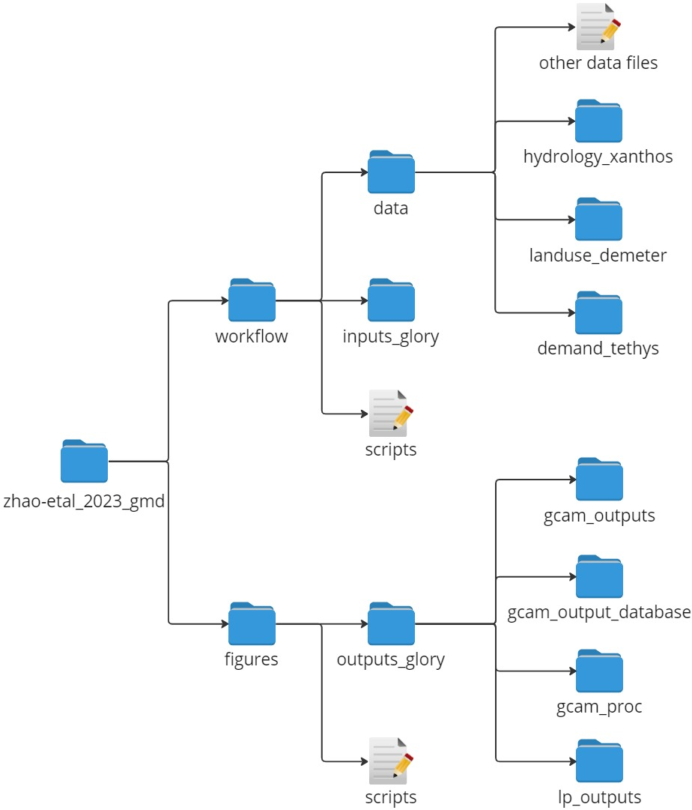

[](https://doi.org/10.5281/zenodo.10211057)

# Representing Reservoir Water Storage in the Global Change Analysis Model (GCAM)

Mengqi Zhao<sup>1\*</sup>, Thomas B. Wild<sup>2</sup>, Neal T. Graham<sup>2</sup>, Son Kim<sup>2</sup>, Matthew Binsted<sup>2</sup>, AFK Kamal Chowdhury<sup>3</sup>, Siwa Msangi<sup>4</sup>, Pralit Patel<sup>2</sup>, Chris R. Vernon<sup>1</sup>, Hassam Niazi<sup>2</sup>, Hong-Yi Li<sup>5</sup>, Guta Abeshu<sup>5</sup>

<sup>1 </sup>Pacific Northwest National Laboratory, Richland, 99354, United States <br>
<sup>2 </sup>Joint Global Change Research Institute, Pacific Northwest National Laboratory, College Park, 20740, United States <br>
<sup>3 </sup>Earth System Science Interdisciplinary Center, University of Maryland, College Park, 20740, United States <br>
<sup>4 </sup>Economic Research Service, U.S. Department of Agriculture, Washington DC, 20250, United States <br>
<sup>5 </sup>Department of Civil and Environmental Engineering, University of Houston, Houston, 77204, United States <br>


\* corresponding author:  Mengqi Zhao (mengqi.zhao@pnnl.gov)

## Contents

- [Abstract](#abstract)
- [Journal Reference](#journal-reference)
- [Code Reference](#code-reference)
- [Data Reference](#data-reference)
- [Contributing Modeling Software](#contributing-modeling-software)
- [Reproduce My Experiment](#reproduce-my-experiment)
- [Reproduce My Figures](#reproduce-my-figures)

## Abstract
Water resources shape, and are shaped by, broader interactions with climate, land, energy, and socioeconomic systems. Reservoirs, in particular, play a significant role in modifying the spatiotemporal availability of surface water to meet multi-sector human demands, despite representing a relatively small fraction of the global water budget. Yet the integrated modelling frameworks that explore the interactions among these systems at a global scale often contain limited representations of water storage dynamics (e.g., human impacts on evolving reservoirs).  In this study, we implement a representation of global water storage in the Global Change Analysis Model (GCAM) to enable exploration of the future role (e.g., expansion) of reservoir water storage globally in meeting demands for, and evolving in response to interactions with, the climate, land, and energy systems. GCAM represents 235 global water basins, operates at 5-year time steps, and uses supply curves to capture economic competition among renewable water (e.g., via reservoirs), non-renewable groundwater, and desalination. Our approach consists of developing a Global Reservoir Yield (GLORY) model with a Linear Programming (LP) algorithm that is dynamically linked with GCAM. The new approach improves the representation of reservoir water storage in GCAM in several ways. Firstly, the GLORY model identifies the cost to supply increasing levels of reliable water supply from reservoir storage, considering regional physical and economic dynamics, including evolving monthly reservoir hydrologic inflows and demands, and the levelized cost to construct additional reservoir storage capacity. Secondly, we analyse the potential for reservoir storage capacity expansion by applying constraints related to population, protected land, water sources, and cropland. We also examine how climate and socioeconomic impacts influence the pathways for reservoir expansion. Additionally, the pioneering GLORY - GCAM feedback loop allows evolving water demands from GCAM to inform the LP-based GLORY model, resulting in an updated supply curve at each time step, and enables GCAM to establish a more meaningful economic value of water. This study improved our understanding on the sensitivity of reliable reservoir water supply to multiple physical and economic dimensions, such as sub-annual variations in climate conditions and human water demands, especially for basins experiencing socioeconomic droughts.  This new approach enables a broad suite of previously unexplored questions focused on the future of reservoir storage expansion and its multi-sector, multi-system implications under evolving forces such as climate and socioeconomic change. 

[Back to Contents](#contents)

## Journal Reference

> Zhao, M., Wild, T.B., Graham, N.T., Kim, S., Binsted, M., Chowdhury, K., Msangi, S., Patel, P., Vernon, C.R., Niazi, H., Li, H., Abeshu, G. 2023. Representing reservoir water storage in the Global Change Analysis Model (GCAM). _Geoscientific Modeling Development_, In Progress.

[Back to Contents](#contents)

## Code Reference

<!--
References for each minted software release for all code involved.  

These are generated by Zenodo automatically when conducting a release when Zenodo has been linked to your GitHub repository. The Zenodo references are built by setting the author order in order of contribution to the code using the author's GitHub user name.  This citation can, and likely should, be edited without altering the DOI.

If you have modified a codebase that is outside of a formal release, and the modifications are not planned on being merged back into a version, fork the parent repository and add a `.<shortname>` to the version number of the parent and construct your own name.  For example, `v1.2.5.hydro`.
-->

> Zhao, M., Wild, T.B., Graham, N.T., Kim, S., Binsted, M., Chowdhury, K., Msangi, S., Patel, P., Vernon, C.R., Niazi, H., Li, H., Abeshu, G. 2023. Repository for Zhao-etal_2023_GMD v1.0.0. Zenodo. doi:10.5281/zenodo.10211057.

[Back to Contents](#contents)

## Data Reference

### Input Data

<!--
Reference for each minted data source for your input data.  For example:

Human, I.M. (2021). My input dataset name [Data set]. DataHub. https://doi.org/some-doi-number
-->

<a name="table1"></a>
**Table 1:** Input data.

| Input | Model or Source | Link or DOI | Description |
|---|---|---|---|
| GLORY Data | **[GCIMS]** Various Sources | [](https://doi.org/10.5281/zenodo.8436685) | Reference data and selected Xanthos, Tethys, and Demeter outputs (e.g., single climate scenario) for the study. This base dataset provides the essential files needed to reproduce the experiment. |
| Hydrological Inputs | **[GCIMS]** Xanthos | [](https://doi.org/10.5281/zenodo.8436685) | Monthly global runoff, streamflow, and evaporation at 0.5 degree resolution. `GLORY Data` includes Xanthos output for one selected scenario. |
| Water Demand | **[GCIMS]** Tethys | [](https://doi.org/10.5281/zenodo.8436685) | Monthly global water withdrawals for six demand sectors (electricity, irrigation, livestock, mining, industry, and municipal) at 0.5 degree resolution. `GLORY Data` includes Tethys output for one selected scenario.|
| Irrigated Croplands | **[GCIMS]** Demeter | [](https://doi.org/10.5281/zenodo.8436685) | Global land use land cover change data at 0.5 degree resolution. `GLORY Data` includes Demeter output for one selected scenario. |
| Reservoirs | GranD v1.3 | [GranD Link](https://www.globaldamwatch.org/grand) | Global Reservoir and Dam dataset |
| Lakes | HydroLAKES v1.0 | [HydroLAKES Link](https://www.hydrosheds.org/products/hydrolakes) | Shoreline polygons of all global lakes with a surface area of at least 10 ha |
| Population | SEDAC | [SEDAC Population Link](https://sedac.ciesin.columbia.edu/data/set/popdynamics-1-8th-pop-base-year-projection-ssp-2000-2100-rev01) | Global one-eighth degree population based on SSP2 |
| World Database on Protected Areas (WDPA) | Protected Planet | [WDPA Link](https://www.protectedplanet.net) | Global protected terrestrial and marine areas |
| Water Bodies | WWF GLWD-3 | [GLWD Link](https://www.worldwildlife.org/pages/global-lakes-and-wetlands-database) | Lakes, reservoirs, rivers and different wetland types in the form of a global raster map at 30-second resolution |
| Slope | EarthEnv | [EarthEnv Link](https://www.earthenv.org/topography) | Global mean slopes at 50km resolution based on DEM products from global GMTED2010 |


### Output Data

<!--
Reference for each minted data source for your output data.  For example:

Human, I.M. (2021). My output dataset name [Data set]. DataHub. https://doi.org/some-doi-number
-->

> Zhao, M., Wild, T.B., Graham, N.T., Kim, S., Binsted, M., Chowdhury, K., Msangi, S., Patel, P., Vernon, C.R., Niazi, H., Li, H., Abeshu, G. 2023. GLORY - Input and Output Data (v1.0) [Data set]. Zenodo. https://doi.org/10.5281/zenodo.8436685

[Back to Contents](#contents)


## Contributing Modeling Software

<a name="table2"></a>
**Table 2:** Contributing modeling software.

| Model | Version | Repository Link | DOI |
|-------|---------|-----------------|-----|
| GLORY | v1.0.0 | [GLORY Gituhub](https://github.com/JGCRI/glory/tree/dev) |  |
| GCAM | v5.4 | [GCAM Github](https://github.com/JGCRI/gcam-core) | [](https://doi.org/10.5281/zenodo.3908600) |
| gcamwrapper | dev | [gcamwrapper Github](https://github.com/JGCRI/gcamwrapper) |  |
| Xanthos | v2.3.1 | [Xanthos Github](https://github.com/JGCRI/xanthos) | [](https://doi.org/10.5281/zenodo.2677687) |
| Tethys | v1.2.0 | [Tethys Github](https://github.com/JGCRI/tethys) | [](https://doi.org/10.5281/zenodo.3234939) |
| Demeter | v1.1.0 | [Demeter Github](https://github.com/JGCRI/demeter) | [](https://doi.org/10.5281/zenodo.3234948) |

[Back to Contents](#contents)

## Reproduce My Experiment

1. Install the software components required to conduct the experiment from [Contributing modeling software](#contributing-modeling-software).
2. Clone the GitHub repository to your local device. The repository mainly consists of scripts for reproducing the experiment.
```
git clone https://github.com/JGCRI/zhao-etal_2023_gmd.git
```
3. Download the supporting input data required to conduct the experiment from [Input data](#input-data). Put the downloaded data within cloned `workflow` and `figures` folders following the folder structure shown in the figure below.

<a name="table3"></a>
**Table 3:** folder structure.

| Folder Name | Description | 
| --- | --- |
| `workflow/data` | This folder includes *raw* input data (e.g., hydrology, socioeconomic, and reference data) that is used to produce standard inputs to the GLORY model. We provide data originated from the project (labeled with `GCIMS`) and ask users to download copy-right data from other sources listed in [Input data](#input-data). |
| `workflow/inputs_glory` | This folder includes the standard inputs produced using the `GLORY_inputs_*.R` scrips. User can choose to produce those files through the R scripts, or directly download these files. |
| `figures/outputs_glory` | This folder includes outputs from the GLORY model. These outputs are used to produce figures using the scripts under [`figures`](/figures/) directory. |


<a name="figure1"></a>

<p align="center"> </p>

<br>

4. Run the following scripts listed in [Table 4](#table4) in the [`workflow`](/workflow/) directory to re-create this experiment. More details of inputs and outputs for each script are described in the [`workflow`](/workflow/).

<a name="table4"></a>
**Table 4:** Scripts to reproduce my experiments.

| Script Name | Description | 
| --- | --- |
| `GLORY_inputs_climate_future.R` | Script to generate climate inputs to the GLRY model |
| `GLORY_inputs_monthly_profiles_future.R` | Script to generate historical inputs 1) monthly profiles for inflow, evaporation, and demand; and 2) average annual demand by sector at basin level |
| `GLORY_inputs_reservoir.R` | Script to generate the information of reservoir storage capacity and expansion potential at basin level |
| `GLORY_inputs_mean_slope_basin.R` | Script to generate mean slope of basin |
| `GLORY_gcamwrapper.py` | Script to run the GLORY model |

5. Download and unzip the output data from my experiment [Output data](#output-data).
6. compare my outputs to those from the publication.


[Back to Contents](#contents)

## Reproduce My Figures
Use the scripts found in the [`figures`](/figures/)  directory to reproduce the figures used in this publication.

<a name="table5"></a>
**Table 5:** Scripts to reproduce my figures.

| Script Name | Figure |
| --- | --- |
| `plot_reservoir.R` | Figure 1 |
| `plot_supply_curve.R` | Figure 3 |
| `plot_historical_supply_demand.R` | Figure 4 |
| `plot_exploitable_zones.R` | Figure 5 |
| `plot_unit_cost.R` | Figure 6 |
| `plot_capacity_yield.R` | Figure 7 |
| `plot_supply_curve.R` | Figure 8 |
| `plot_supply_curve.R` | Figure 9 |
| `plot_water_withdrawal.R` | Figure 10 |
| `plot_correlation.R` | Figure 11 |


[Back to Top](#representing-reservoir-water-storage-in-the-global-change-analysis-model-gcam)
